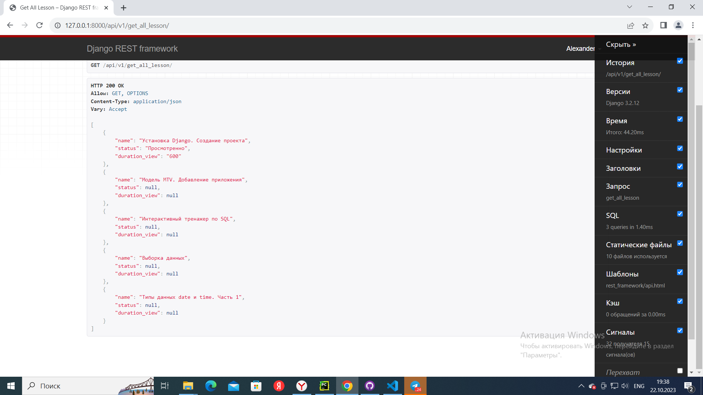
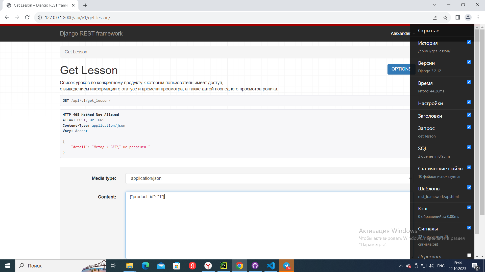
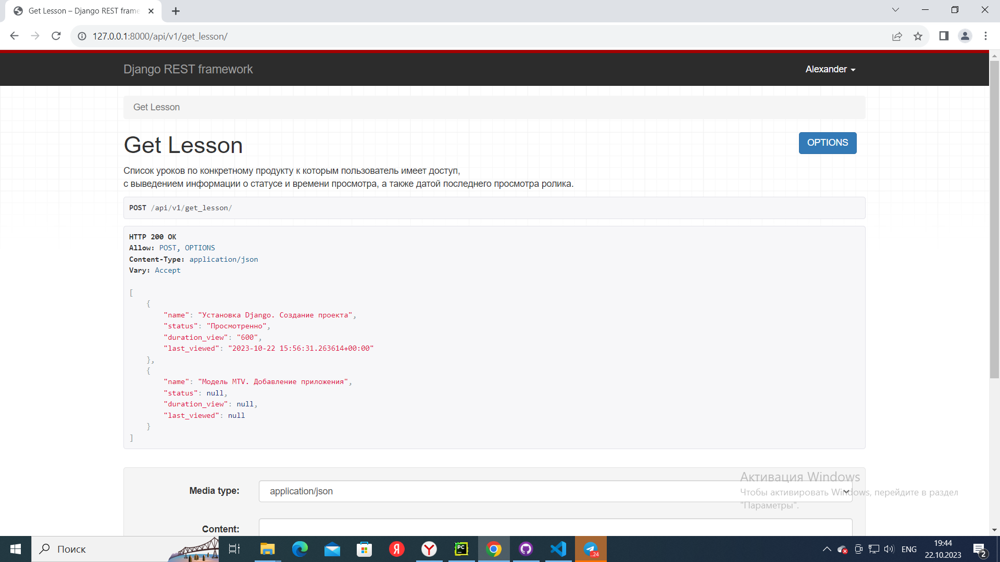
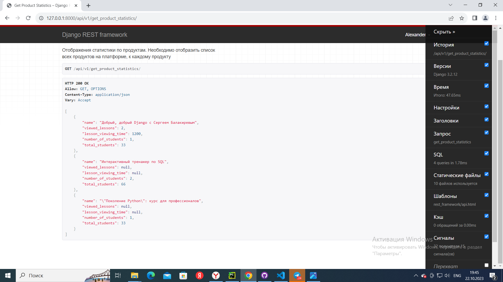

# Тестовое задание HardQode
время выполнения ~ 8 часов для junior уровня
## Построение системы для обучения
Суть задания заключается в проверке знаний построения связей в БД и умение правильно строить запросы без ошибок N+1.

Перед тем, как приступить к выполнению задания, советуем изучить материалы, которые помогут в выполнении заданий:
1. https://docs.djangoproject.com/en/4.2/intro/tutorial01/
2. https://docs.djangoproject.com/en/4.2/topics/db/models/
3. https://docs.djangoproject.com/en/4.2/topics/db/queries/
4. https://docs.djangoproject.com/en/4.2/ref/models/querysets/
5. https://www.django-rest-framework.org/tutorial/quickstart/
6. https://www.django-rest-framework.org/api-guide/viewsets/
7. https://www.django-rest-framework.org/api-guide/serializers/

### Построение архитектуры(3 балла)
В этом задании у нас есть три бизнес-задачи на хранение:

1. Создать сущность продукта. У продукта должен быть владелец. Необходимо добавить сущность для сохранения доступов к продукту для пользователя.
2. Создать сущность урока. Урок может находиться в нескольких продуктах одновременно. В уроке должна быть базовая информация: название, ссылка на видео, длительность просмотра (в секундах).
3. Урок могут просматривать множество пользователей. Необходимо для каждого фиксировать время просмотра и фиксировать статус “Просмотрено”/”Не просмотрено”. Статус “Просмотрено” проставляется, если пользователь просмотрел 80% ролика.

### Написание запросов(7 баллов)
В этом пункте потребуется использовать выполненную вами в прошлом задании архитектуру:

    1. Реализовать API для выведения списка всех уроков по всем продуктам к которым пользователь имеет доступ, с выведением информации о статусе и времени просмотра.
    2. Реализовать API с выведением списка уроков по конкретному продукту к которому пользователь имеет доступ, с выведением информации о статусе и времени просмотра, а также датой последнего просмотра ролика.
    3. Реализовать API для отображения статистики по продуктам. Необходимо отобразить список всех продуктов на платформе, к каждому продукту приложить информацию:
       a) Количество просмотренных уроков от всех учеников.
       b) Сколько в сумме все ученики потратили времени на просмотр роликов.
       c) Количество учеников занимающихся на продукте.
       d) Процент приобретения продукта (рассчитывается исходя из количества полученных доступов к продукту деленное на общее количество пользователей на платформе).

### Результат выполнения:
    1. Выполненная архитектура на базе данных SQLite с использованием Django.
    2. Реализованные API на базе готовой архитектуры.

### Мы ожидаем:
    Ссылка на публичный репозиторий в GitHub с выполненным проектом.

___
1. Реализовать API для выведения списка всех уроков по всем продуктам к которым пользователь имеет доступ, с выведением информации о статусе и времени просмотра.

2. Реализовать API с выведением списка уроков по конкретному продукту к которому пользователь имеет доступ, с выведением информации о статусе и времени просмотра, а также датой последнего просмотра ролика.
### Вводим данные {"product_id": "1"}

### Получаем:

3. Реализовать API для отображения статистики по продуктам. Необходимо отобразить список всех продуктов на платформе, к каждому продукту приложить информацию:

a) Количество просмотренных уроков от всех учеников.

b) Сколько в сумме все ученики потратили времени на просмотр роликов.

c) Количество учеников занимающихся на продукте.

d)Процент приобретения продукта (рассчитывается исходя из количества полученных доступов к продукту деленное на общее количество пользователей на платформе).
'name' - Наименование продукта
'viewed_lessons' - Количество просмотров со статусом "Просмотренно"
'lesson_viewing_time' - Общее количество времени на просмотр роликов
'number_of_students' - Количество учеников занимающихся на продукте
'total_students' - Процент приобретения продукта

